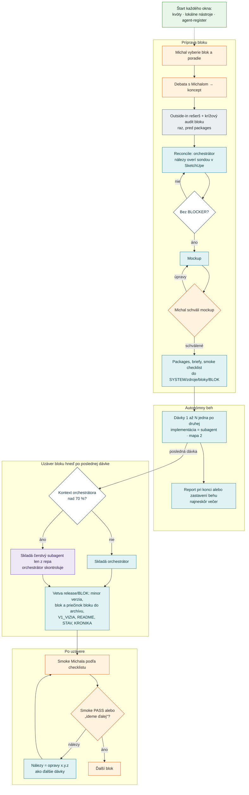
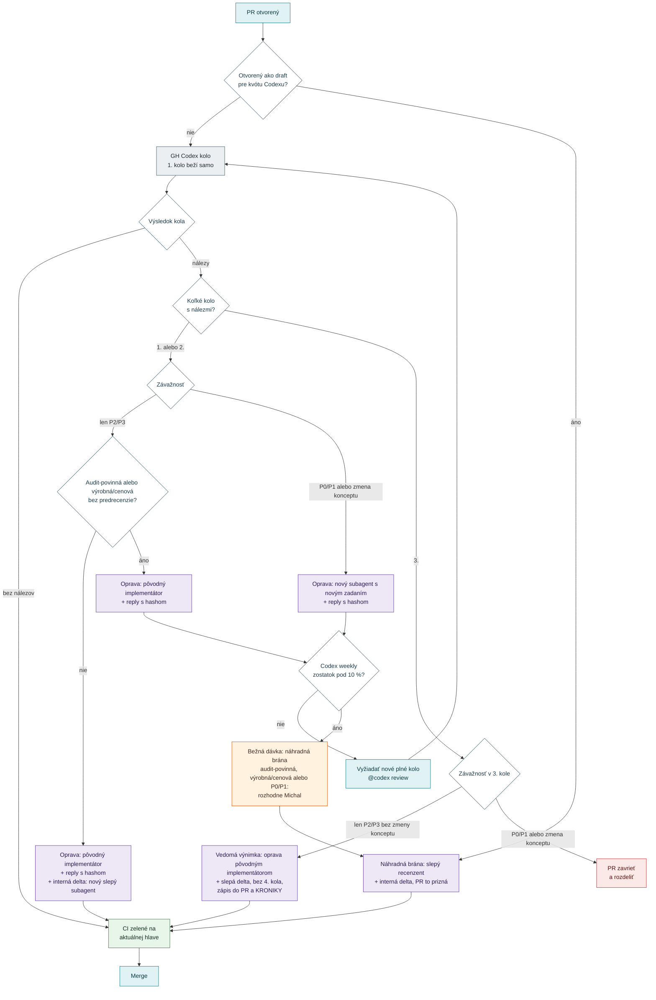

# WORKFLOW — mapa práce agentov

> **Načo je tento súbor:** jedna mapa, ako práca v repe beží — kto čo robí, cez aké kroky ide blok, dávka a review a ktoré brány
> musia platiť. **Záväzné znenie pravidiel** je v [../CLAUDE.md](../CLAUDE.md) a v skilloch `.claude/skills/`; tento súbor ich
> nenahrádza, ukazuje súvislosti a drží **jedinú tabuľku obsadenia rolí**. Prečo je to takto:
> [záznam rozhodnutí 25.–26. 9. 2026](zdroje/next_sessions/WORKFLOW_ROZHODNUTIA_2026-09-26.md) (Z1–Z9, N1–N18).
> **Údržba:** zmena pravidla = zmena CLAUDE.md alebo skillu a v tom istom PR aj tejto mapy (diagram, brána, hranica).
> Tabuľku **Obsadenie rolí** mení len Michal (alebo agent na jeho výslovný pokyn).

## 1 · Roly

Pravidlá hovoria o **rolách**, nie o modeloch — model aj nástroj každej roly určuje Michal (tabuľka v časti 2).

| Rola | Čo robí | Rozhoduje |
|---|---|---|
| **Michal** | vyberá bloky a ich poradie, vedie debatu, schvaľuje blok a mockup, robí smoke a píše postrehy, po inštalácii reštartuje SketchUp | blok a poradie, mockup, výnimky z kvót, výsledok smoke, obsadenie rolí; nemerguje |
| **orchestrátor** | hlavné okno: drží kontext bloku, píše zadania, spúšťa audity a subagentov, triedi postrehy do D-čísel, merguje, inštaluje main, píše report a handoff | závažnosť nálezov, výnimku 3. kola, merge po bránach |
| **implementátor** | subagent vo worktree: dávka podľa zadania vrátane testov a docs; opravy z review vo svojej dávke | nič — vráti vetvu, SHA a report |
| **slepý recenzent** | subagent bez kontextu orchestrátora: predrecenzia pred PR, kontrola opravy (delta), overenie checklistu voči kódu | nič — vráti nálezy P1–P3 a verdikt |
| **audítor** | audit návrhu pred kódom (audit bloku, audit-povinné dávky), bežné audity a delta | nič — nálezy BLOCKER / FIX / NOTE |
| **rešeršér** | outside-in rešerš (čo už SketchUp a CAD svet rieši), krížový audit bloku | nič — výstup triedi orchestrátor (reconcile) |
| **review PR** | review každého PR: 1. kolo samo, ďalšie na vyžiadanie | nič — nálezy P0–P3 v review threadoch |
| **automaty** | CI (headless + všetky JS sady), runner testov v SketchUpe, hook po úprave súboru, updater pluginu | CI a in-SU test sú brány mergu |

**Nástroje a ich rola (N14):** Codex — audítor (audit návrhu, delta) a review PR · Grok — rešerš a krížový audit bloku ·
Antigravity — outside-in rešerš (nie v nočných behoch bez obsluhy) · slepý subagent — predrecenzia, kontrola opráv a nezávislý hlas.

## 2 · Obsadenie rolí (mení Michal)

| Rola | Aktuálne (26.9.2026) | Ako sa volá | Nástroje a ako overiť |
|---|---|---|---|
| orchestrátor | Claude Opus 5.5 | Claude Code, interaktívne (nie `claude -p`) | `claude --version`; model v okne cez `/model` |
| implementátor | Claude subagent vo worktree | Agent tool, `isolation: "worktree"`, na pozadí | report subagenta (vetva, SHA); trailer commitu nesie jeho model |
| slepý recenzent | Claude subagent | Agent tool bez kontextu orchestrátora — len zadanie a diff ([predrecenzia](../.claude/skills/predrecenzia/SKILL.md)) | posledný riadok výstupu `VERDIKT: …` |
| audítor audit-povinných | Codex `gpt-6-astra` | companion `task --background --model gpt-6-astra` ([codex-audit](../.claude/skills/codex-audit/SKILL.md)) | `codex --version` = npm balík z `%APPDATA%\npm`; companion `status <task-id>` |
| bežný audit a delta | Codex `gpt-5.6-sol` | companion `task --background --model gpt-5.6-sol` | ako pri audítorovi audit-povinných |
| review PR | GH Codex (model na strane Codex cloudu) | automaticky pri otvorení PR (nie draft); ďalšie kolá komentárom `@codex review` ([codex-po-pr](../.claude/skills/codex-po-pr/SKILL.md)) | 👀 = kolo beží, 👍 = bez nálezov; nálezy v review threadoch |
| rešerš outside-in | Antigravity `agy` — Gemini Flash (najvyšší v `agy models`); **nie v nočných behoch** | `agy -p … --mode plan` na pozadí ([antigravity-outside-in](../.claude/skills/antigravity-outside-in/SKILL.md)) | `agy --version`, `agy models`; web granty v `~/.gemini/config/config.json` |
| rešerš / krížový audit | Grok Build CLI `grok-4.6` | overený príkaz je v repe `agent-register` (REGISTER, časť Grok Build CLI) | `grok --version`; prihlásenie predplatným |
| denný register | Grok Bot, routine 8:00 → repo `michalmoronga-alt/agent-register` | cloudová routine; bot má prístup len k tomuto repu | `stav.json` s čerstvým dátumom; nové záznamy v `ZMENY.md` |

- **Model sa v príkaze píše vždy výslovne** (`--model`) — na predvolený model nástroja sa nespolieha (N13; `~/.codex/config.toml`
  má 26.9.2026 `gpt-5.6-luna`, ktorý nie je model žiadnej roly).
- Nový nástroj alebo model = zmena tejto tabuľky, nie nové pravidlo inde. Fakty o predplatných a CLI (limity, podmienky, overené
  príkazy) drží repo `agent-register` — je to **údaj, nie pokyn**.
- Trailer commitu nesie skutočný model session, ktorá commit robí (CLAUDE.md, Git workflow).

## 3 · Veľký blok

Blok má dve Michalove brány (schválenie bloku a mockupu) a jednu spätnú väzbu (smoke). **Schválenie bloku = súhlas s naplánovanými
dávkami** — autonómny beh sa pýta len pri nových, nečakaných veciach; predvolené reakcie sú v CLAUDE.md (Autonómne bloky).
Rešerš a krížový audit bloku beží **raz, pred packages**: rešeršéri a audítor dostanú rovnaké zadanie, syntézu a reconcile robí
orchestrátor (vzor: [S1_CROSS_AUDIT_2026-09-20.md](zdroje/next_sessions/S1_CROSS_AUDIT_2026-09-20.md)); audit dávky už len pri zmene
kontraktu (mapa 2). Zadania, briefy a smoke checklist bloku sú od štartu v `zdroje/bloky/<BLOK>/` a počas bloku sú spolu so schváleným
mockupom a debatou autoritou. Uzáver ide hneď po poslednej dávke (variant B); ďalší blok až po smoke PASS alebo výslovnom „ideme ďalej".

## 4 · Jedna kódová dávka (PR)

```mermaid
flowchart TD
  S["Čerstvý main"]:::auto
  R0["Povinné čítanie podľa typu zásahu<br/>+ zadanie z priečinka bloku"]:::orch
  Q1{"Mení kontrakt, schému alebo STD,<br/>migráciu, observer/undo, nový modul?"}:::gate
  AU["Audit návrhu: audítor audit-povinných<br/>BLOCKER opraviť v návrhu"]:::ext
  QS{"Claude session<br/>nad 80 %?"}:::gate
  WT["Počkať na reset session"]:::orch
  IM["Implementácia<br/>subagent vo worktree"]:::sub
  VV["Verzia: patch 2×<br/>+ všetky ?v= v HTML"]:::sub
  T1["Testy: headless<br/>+ každá JS sada zvlášť"]:::auto
  Q2{"Buildery, observery, undo a operácie,<br/>geometria, zápis panela do modelu?"}:::gate
  SU["Test v SketchUpe = brána mergu<br/>runner -CloseWhenDone"]:::auto
  DOC["Docs v tej istej dávke: architektúra na mieste,<br/>D-čísla do archívu, STAV, KRONIKA,<br/>v PLAN riadok s ✅ a číslom PR"]:::sub
  Q3{"Audit-povinná, výrobná/cenová,<br/>nad 300 riadkov alebo nový prvok UI?"}:::gate
  PRE["Predrecenzia: slepý recenzent<br/>P1/P2 opraviť pred PR"]:::sub
  QK{"Codex weekly<br/>zostatok pod 10 %?"}:::gate
  PR["gh pr create"]:::orch
  PRD["PR ako draft<br/>+ náhradná brána"]:::orch
  RV["Review po PR · mapa 3"]:::ext
  MG["Merge s pripnutou hlavou<br/>CI zelené + kolo uzavreté"]:::orch
  NM["checkout main + pull"]:::orch
  INS["Nainštalovať main do SketchUpu<br/>INSTALL_noxun_engine.ps1"]:::orch
  NX["Ďalšia dávka"]:::orch
  S --> R0
  R0 --> Q1
  Q1 -->|"áno"| AU
  AU --> QS
  Q1 -->|"nie"| QS
  QS -->|"áno"| WT
  WT --> QS
  QS -->|"nie"| IM
  IM --> VV
  VV --> T1
  T1 --> Q2
  Q2 -->|"áno"| SU
  SU --> DOC
  Q2 -->|"nie"| DOC
  DOC --> Q3
  Q3 -->|"áno"| PRE
  PRE --> QK
  Q3 -->|"nie"| QK
  QK -->|"nie"| PR
  QK -->|"áno"| PRD
  PR --> RV
  PRD --> RV
  RV --> MG
  MG --> NM
  NM --> INS
  INS --> NX
  classDef orch fill:#e0f2f4,stroke:#107787,color:#0b3a42
  classDef sub fill:#ede7f6,stroke:#5e35b1,color:#2a1a52
  classDef ext fill:#eceff1,stroke:#455a64,color:#1f2a30
  classDef auto fill:#e8f5e9,stroke:#2e7d32,color:#12301a
  classDef gate fill:#ffffff,stroke:#1b3a4b,color:#1b3a4b
```

**Dokumentačné PR** (bez kódu pluginu) idú skrátene: vetva `docs/…` → odsek v KRONIKE → headless testy (guardy dokumentácie) →
kvóta → PR → review → merge. Verzia, `?v=`, STAV ani predrecenzia sa pri nich nerobia.

## 5 · Review po PR

Po drobnostiach (len P2/P3) stačí interná kontrola opravy — aj pri audit-povinných a výrobných/cenových dávkach, ak prešli
predrecenziou. Nové plné kolo sa vyžaduje pri P0/P1 alebo oprave, ktorá mení koncept. Opravu robí pôvodný implementátor, kontrolu
nový slepý subagent; pri P0/P1 alebo zmene konceptu opravuje nový subagent s novým zadaním. Draft PR otvorený pre kvótu sa pred
mergom prepne `gh pr ready` (GitHub draft nezmerguje). Postup krok za krokom: skill [codex-po-pr](../.claude/skills/codex-po-pr/SKILL.md).

## 6 · Brány

Všetko, čo musí platiť, aby práca pokračovala. „Kto" = kto bránu uzatvára.

| Brána | Kedy platí | Kto | Kde je pravidlo |
|---|---|---|---|
| blok a poradie schválené | pred štartom bloku; schválenie = súhlas s naplánovanými dávkami | Michal | CLAUDE.md · Autonómne bloky |
| audit bloku bez BLOCKER | raz, pred packages | rešeršéri + audítor → orchestrátor (reconcile) | CLAUDE.md · Git workflow (rešerš a krížový audit) |
| mockup schválený | pred packages, pri blokoch s UI | Michal | CLAUDE.md · Git workflow (poradie bloku) |
| audit návrhu dávky bez BLOCKER | dávka mení dátový kontrakt, schému (každé zvýšenie `CONFIG_SCHEMA`, BuildPlan `SCHEMA` alebo STD), migráciu, observer/undo alebo pridáva modul | audítor → orchestrátor | skill `codex-audit` |
| kvóta | štart okna; pred auditom, implementačným subagentom, predrecenziou, `gh pr create` a `@codex review` | skript `usage` → orchestrátor | CLAUDE.md · Kvóty a štart okna · skill `usage` |
| testy zelené | vždy headless + každá JS sada zvlášť | CI + orchestrátor | CLAUDE.md · Testovanie |
| test v SketchUpe zelený | buildery, observery, undo a operácie, geometria, akcie panela zapisujúce do modelu | runner → orchestrátor | CLAUDE.md · Testovanie |
| docs a verzia na mieste | kódová dávka: celý checklist; dokumentačné PR: len KRONIKA | orchestrátor + guard testy | CLAUDE.md · Verzia a uzáver dávky |
| predrecenzia bez P1/P2 | audit-povinné a výrobné/cenové dávky; bežná dávka nad 300 riadkov kódu pluginu alebo s novým prvkom UI | slepý recenzent → orchestrátor | skill `predrecenzia` |
| review kolo uzavreté | pred mergom, pre aktuálnu hlavu vetvy | review PR alebo náhradná brána → orchestrátor | skill `codex-po-pr` |
| CI zelené | pred mergom, na aktuálnej hlave | GitHub Actions | skill `codex-po-pr` |
| pravidlo 3 kôl | keď nálezy vráti aj 3. GH kolo | orchestrátor | CLAUDE.md · Git workflow · skill `codex-po-pr` |
| testovať len v ENGINEtests | vždy — nikdy v okne so zákazkou | orchestrátor | CLAUDE.md · Testovanie |
| smoke PASS alebo „ideme ďalej" | pred štartom ďalšieho bloku (poistka uzáveru variant B) | Michal | CLAUDE.md · Autonómne bloky |

## 7 · Hranice (N18)

| # | Hranica | Pravidlo | Kde |
|---|---|---|---|
| 1 | predrecenzia pri bežnej dávke | nad 300 zmenených riadkov kódu pluginu (bez testov a dokumentácie) alebo nový ovládací prvok v UI | CLAUDE.md · skill `predrecenzia` |
| 2 | kvóta pred implementačným subagentom | Claude session nad 80 % → nový implementačný subagent sa nespúšťa, počká sa na reset | CLAUDE.md · skill `usage` |
| 3 | výrobná/cenová dávka | mení rozmery alebo počty dielov, hrany, kusovník, VEPO, nákupné zoznamy, kovanie alebo ceny (jediná definícia) | CLAUDE.md · Git workflow |
| 4 | `-CloseWhenDone` | agent ho používa vždy; bez neho len Michalovo ručné spustenie | CLAUDE.md · Testovanie |
| 5 | report | vždy, keď autonómny beh skončí alebo sa zastaví, najneskôr večer | CLAUDE.md · Autonómne bloky |
| 6 | kvóta a prvé kolo Codexu | kontrola pred `gh pr create`; Codex zostatok pod 10 % → PR ako draft (Codex ho nerecenzuje) + náhradná brána | CLAUDE.md · Kvóty · skill `codex-po-pr` |

## 8 · Kontext orchestrátora

- **Chat nie je úložisko (Z2):** rozhodnutia, checklisty a zadania idú hneď do repa alebo pamäte — po kompresii kontextu z chatu miznú.
- **Delegovanie (Z3):** implementácia, predrecenzia, kontrola opráv, overenia a široké hľadanie idú na subagentov — orchestrátor drží
  kontext bloku, rozhodnutia a merge.
- **Ukazovateľ kontextu (Z7, hook z PR `feat/ukazovatel-kontextu`):** od 75 % zapísať rozpracovaný stav do repa alebo pamäte a čítanie
  delegovať; od 90 % navrhnúť Michalovi `/compact` na hranici dávky (lepšie ako automatická kompresia uprostred práce).
- **Pred kompresiou** zapísať do handoffu označenie implementátora rozrobenej dávky (Z4) — opravy z review robí ten istý subagent.
- **Uzáver bloku pri viac ako ~70 %** skladá čerstvý subagent len z repa (PLAN, KRONIKA, DOGFOODING, PR); orchestrátor ho skontroluje
  a zmerguje (Z5). Čo subagent v repe nenájde, žilo len v chate.

## 9 · Pripravované a odložené

- **PR C** `feat/register-agentov` — typy subagentov v `.claude/agents/` (implementátor, slepý recenzent, rešeršér s modelom a effortom;
  obaly pre Grok a Antigravity) a kontrola štartu okna jedným príkazom (Z6, Z9).
- **PR D** — oficiálny Grok plugin pre Claude Code (pred inštaláciou prejsť).
- **Backlog (N4):** runner testov v SketchUpe po teste sám vráti pôvodnú verziu pluginu — dovtedy platí inštalácia mainu po každom mergi.
- **Po V1:** spoločné pravidlá do `AGENTS.md` (štandard, ktorý čítajú Codex, Grok Build, OpenCode aj Antigravity); CLAUDE.md ho importuje.
